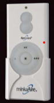
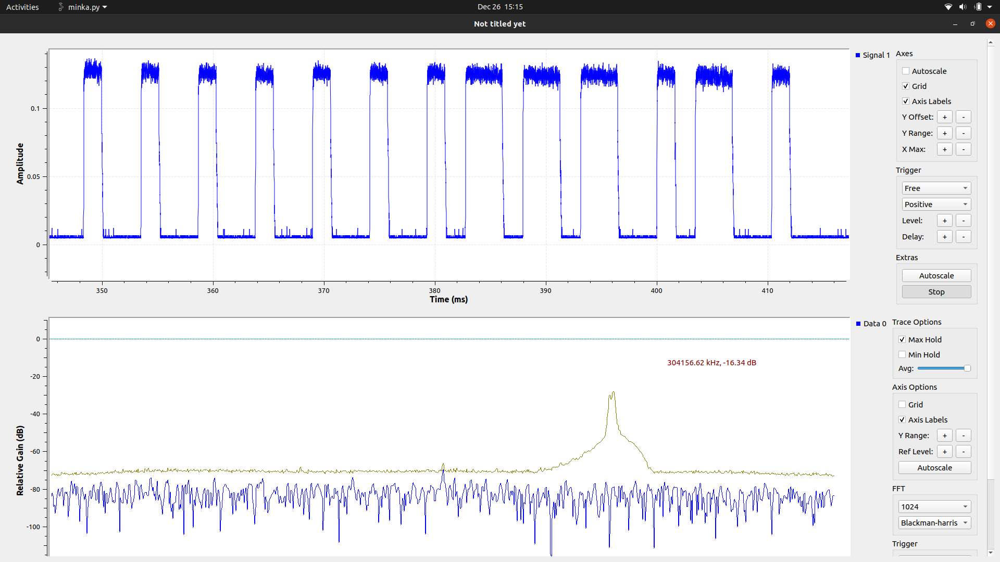
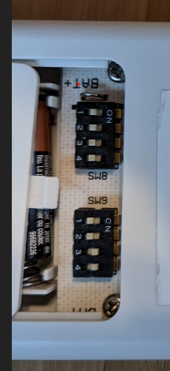

## Controlling a Minka Aire fan using rfcat
### Python code to control a Minka ceiling fan using a [Yard Stick One](https://greatscottgadgets.com/yardstickone/) and [rflib](https://github.com/atlas0fd00m/rfcat) module to simulate the Minka remote control (model TR110A, [FCC ID KUJCE10007](https://fccid.io/KUJCE1007)).


I used a series of software tools and hardware, both RTL-SDR and the Yard Stick One, to reverse engineer the remote control commands. This allows me to automate controlling the fan (e.g. using [Home Assistant](https://www.home-assistant.io/) automation).

### Details
Modulation is ASK/OOK. Each 3-bits (octal) transmitted is a symbol for a single bit value: 0 == 010,  1 == 110.
There are 13 symbols per packet, requiring 39 bits to transmit.
Each symbol pulse is ~2.49ms.


Every packet starts with a single 010 octal (preamble).

The remote's battery compartment has 2 banks of 4 switches, labeled SW8 and SW9.


The switch ON/OFF settings are included in the packet.
```
PREAMBLE = '010'
SW8 = '010010010010'
SW9 = '010010110110'
```
On my remote, and the default in code, SW8 is set as OFF OFF OFF OFF, and SW9 is OFF OFF ON ON. Also, I used this as the basis for deciding what octal was either 0 (OFF) or 1 (ON).

Each button produces a unique set of 4 octals, representing a fan command, included in the packet.
```
OFF = '110010110010'
SLOW = '010010110010'
MED = '010110010010'
FAST = '110010010010'
```
There is also a 4 octal command for the fan's LED light. This single command toggles the light.
```
LIGHT = '010110010110'
```
If you hold down one of the light buttons on the physical remote, you cycle through dimming and brightening the LED light. I didn't implement this, and I really didn't think I'd use it since the LED light on my fan doesn't really dim that well anyway.

Only one command can be sent in a packet.

A complete packet consists of the single preamble octal, 4 octals for the SW8 switch, 4 octals for SW9, and 4 octals for the command. This is a total of 39 bits. The RFxmit method expects a string of bytes, so we have to convert the string representation of the 39 octal bits to a string of bytes with hex escape codes where needed.
```
bits = PREAMBLE + SW8 + SW9 + CMD
b''.join([struct.pack('B', int(bits[i:i+8], 2)) for i in range(0, len(bits), 8)])
```
This does the trick using the struct module, taking 8 bit chunks from the transmit bits, plus the remaining single zero'd bit to round out 5 bytes (40 bits) total.

I use a spacer of 5 bytes as a timing mechanism between broadcasting each packet, so we add that to the packet that will be broadcast multiple times (8 seems to work) in a burst to make sure the fan receives the transmission.

### Obligatory Home Assistant integration
I integrated this with Home Assistant using the MQTT service. I have a daemon running on the device that has the USB Yard Stuck One plugged in. The daemon is an MQTT client that receives Minka commands via topics and serializes launching a process to execute, for example, ``` python minka.py --cmd=off```.

I can now automatically turn the ceiling fan on based on the temperature of the family room, mostly related to the state of the gas fireplace. Breathtaking, I know 😋

The plan is to integrate more ISM (sub 1Ghz) remote control devices with Home Assistant using my single Yard Stick One.

Pretty fun holiday project!

### References
Many resources to be found. I recommend starting with [Great Scott Gadgets education videos](https://greatscottgadgets.com/sdr/), a great learning resource. You don't need a HackRF (or Yard Stick One) to benefit a lot from this video series.

[rfcat](https://github.com/atlas0fd00m/rfcat#installing-on-hardware)

[gnuradio](https://www.gnuradio.org/): A shockingly bloated set of dependencies, but it really did the job in the end.

[rtl_433](https://github.com/merbanan/rtl_433): This also has analysis tools, besides having a large list of existing devices it can decode.

[Nooelec RTL-SDR](https://www.nooelec.com/store/sdr/nesdr-smart-sdr.html)
